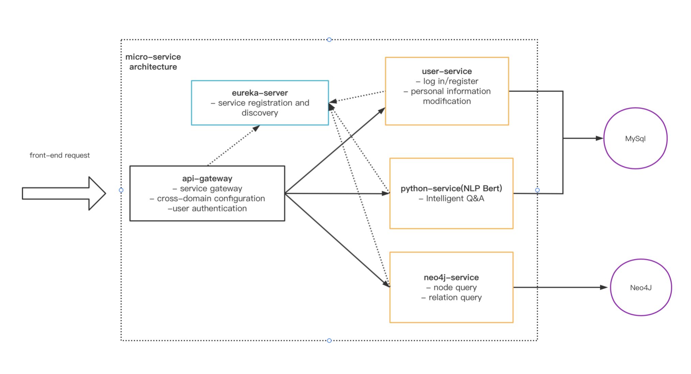
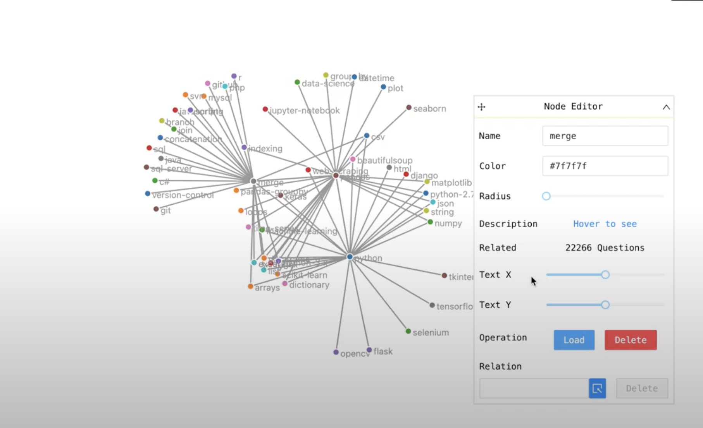
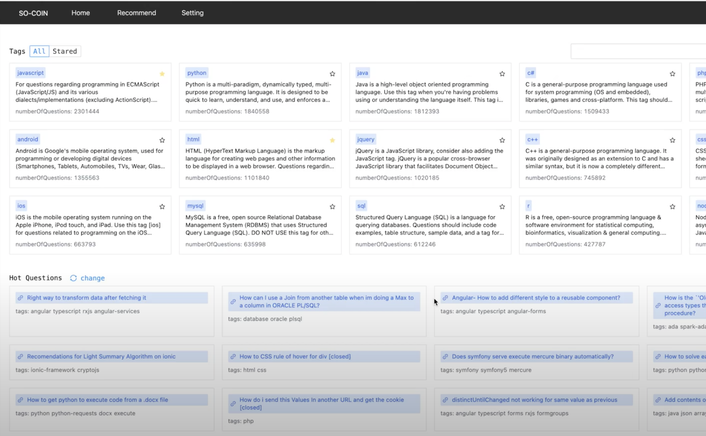
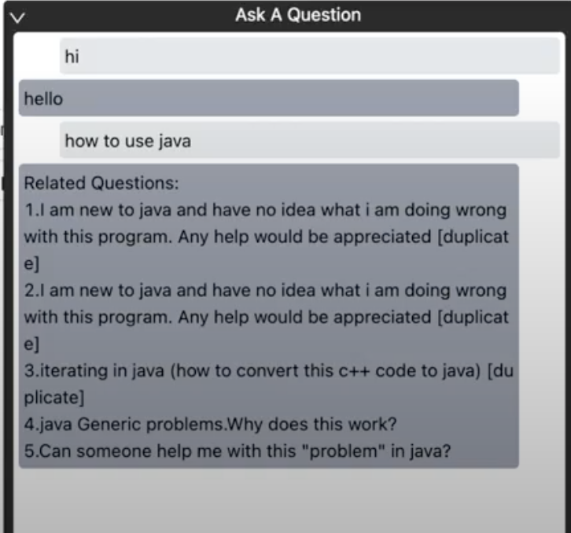

# 1.The micro-service architecture of our knowledgegraph

# 2.The functions of our project.
Model Building

Knowledge Extraction

Intelligent Q&A

# 3.Video Link
This video is a brief introduction of our project
https://drive.google.com/file/d/1kWlUDCS87SlBirvqmLx4M9sSRoMg9NOB/view?usp=sharing

